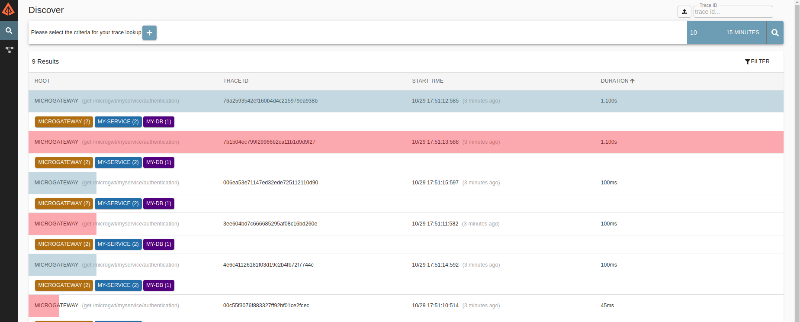
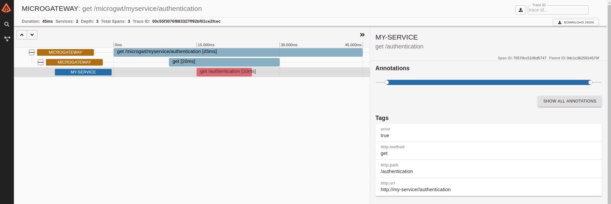
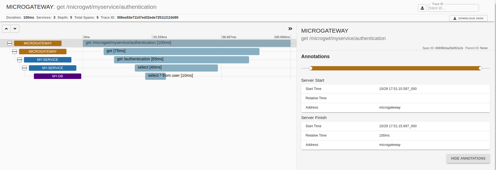

= SPAN GENERATOR

== OVERVIEW

Spans are the footprints to find the path that requests have to follow to get their work done.
These spans contain useful information to detect problems in components or detect problems in connections, as well as it might discover
new components in the playground as many other detections which might come to your head.

The aim of this project is to create those spans which go through different operations in a train of microservices,
quickly and exporting them to different sinks, so to make a test scenario in which you find confident to get your results.

== WHEN IS IT USEFUL?

Working in observability and dealing with spans, this help to have a dataset which is tailored and might help in your development process.

Also it helps to generate spans consume by collectors or redirected to message queues like `kafka` to be consumed by some custom application or tool, testing so their capabilities.

Up to now we have injected limited number of files into `kafka` producers or REST apis to have the content in the other end;
or we have created a number of instrumented sample applications which produce those spans;
or using `tracers` which generate spans base in their API building.

In here the scenarios are mocking. It contains a clock which fits with the need to move accordingly. Which let us generate a big number of spans and try to test loads of spans.

We might say this is useful when you want tasks generating their footprints,
without having those running anywhere and taking over how fast they are invoked and how often they introduce an error.

== SOME CONCEPTS TO BUILD SCENARIOS

The main concepts in here are:

- Components: As the deployed artifacts in servers which are atending requests.
- Tasks: As operation in a server, which might contain subtasks to complete their work.
- Exporter: to define the place the resulted trace goes to.

Also, it is important to mention that the standard is follow at the moment is just Opentracing, but it is mind to include soon Opentelemetry as a promising standard
which might cope good number of vendors.

=== COMPONENTS

Components are pieces in the environment, which might attend to a number of tasks. These components can be defined to introduce some issues, like increasing duration
randomly or introduce errors in spans, creating so more real scenarios.

Components so far are two:

- HttpComponent: Base on brave this component made of a span kind CLIENT in local and span kind SERVER in the remote to link together doing so the connection.
The spans contain when they started and the duration of that span, which ends up in knowing the duration and latencies of component and connection line.

- JdbComponent: They are component simulating relational database instrumentation, what actually does not put anything in the span list. It just completes information
in CLIENT spans to show up the piece is there.

=== TASK

Task are operations in the component, which might need from other subtasks to complete a full work. Tasks can configure their duration and on top of that we can introduce issues
to alter the happy behaviour.

=== EXPORTERS

Exporters are the sinks to which the resulted spans are delivered.

- CounterExporter: This exporter shows in the console, when JVM ends, the number of spans which the application has generated, just in case this number should match with the number
you received in your tool.

- ZipkinExporter: To drain the spans to zipkin so as to be represented in one well known system.

- LogExporter: Shows the generated traces in the given input stream channel.

- SocketExporter: pushing the spans to a server socket

- KafkaExporter: In development. This should push the spans to the message queue.

== HOW TO USE IT

What better than an example to see how to build this scenarios and their results:

We are going to build a common authentication task in which a user connect to a microgateway to reach a target service,
and the operation will perform an authentication with the user credentials in a database:

So first at all we are going to define those components which will trigger some issues in the tasks:

MICROGATEWAY:

[source, java]
----
 HttpComponent microgatewayComponent = new HttpComponent("microgateway");
 microgatewayComponent.configureExtraDurationFn(
         simpleDurationDelayer.setPercentageOfRequests(5).incrementDurationFn(l -> 1_000_000L)
 );
----

In the above component we have called the service name `microgateway` and 5 pencent of request will increment their duration by 1 seconds or effectively 1_000_000 microsenconds.

TARGET SERVICE:

[source, java]
----
HttpComponent customServiceComponent = new HttpComponent("my-service")
        .withFailurePercentage(10)
        .withWarningPercentage(10);
----

In the target service with service name `microservice` we will get 10 percent of request with error and 10 percent with `http.status_code` tag.

DATABASE:

[source, java]
----
JdbcComponent customServiceDatabase = new JdbcComponent("my-db");
----

Our database as storage.

Next we will create tasks in those components and we will chain them to get the dependencies with the  coming call in the stack.

In microgateway we are going to define an operation like `/microgwt/myservice/authentication` which needs from `my-service` at the operation `/authentication`. And this operation
at `my-service` will select user credentials from `my-db` database to validate the user.

[source, java]
----
Task proxyAuthenticationTask = Task.from(microgatewayComponent, "get /microgwt/myservice/authentication");
Task authenticationAtServiceTask = proxyAuthenticationTask.needsFrom(customServiceComponent, "get /authentication");

authenticationAtServiceTask.needsFrom(customServiceDatabase, "select * from user");
----

Now it is time for exporters to which we deliver the spans.

We can create those exporters as:

[source, java]
----
Exporter loggingExporter = new LoggingExporter(outputStream);
Exporter zipkinExporter = new ZipkinExporter("http://localhost:9411");
Exporter socketExporter = new SocketExporter(9999);
Exporter counterExporter = new CounterExporter();
----

Bear in mind `counterExporter` is counting the generated spans in the current execution, and it will show the number of generated traces and the time the execution took.

Finally, we want to export those generated spans for our defined scenario into any output stream, simulating the call frequency of a given endpoint.

[source, java]
----
TraceGenerator.create(List.of(loggingExporter, zipkinExporter, socketExporter, counterExporter))
                .withThreads(2)
                .addTask(proxyAuthenticationTask, 1_000);
----

With `TraceGenerator` we are telling the number of threads our application uses to create spans
and for the added task we set the frequency to request that endpoint.

== RESULTS

With the example above in place, we have generated some spans which have been exported to Zipkin, with the next results:

A list of tasks:

A task without error

And a task with error and the task tags with error key

